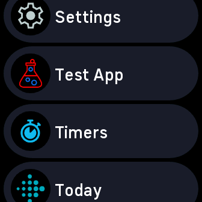

# Fitbit Versa 4 App

This is an unofficial approach for building and sideloading a 3rd-party application to Fitbit Versa 4 and Sense 2 devices.

🚧 All content within this repository is provided for educational purposes only. Use at your own risk. 🚧

This approach consists of:

- Enables the `hosts` command via the `FITBIT_QA_COMMANDS` environment flag.
- Uses unofficial drop-in package for [@fitbit/sdk-build-targets](https://github.com/cmengler/fitbit-sdk-build-targets)
- Sets the `enableProposedAPI` for installs.

## Screenshots

| App List                                | App                           |
|-----------------------------------------|-------------------------------|
|  |  |

## Quick Start

To summarise in four steps:

- [Build the app](#build-the-app)
- [Prepare the bridge](#prepare-the-bridge)
- [Connect the devices](#connect-the-devices)
- [Install the app](#install-the-app)

### Build the app

```sh
cd app && \
yarn install && \
yarn build
```

### Prepare the bridge

Open Fitbit app, access the **Developer Menu**, toggle on **Developer Bridge** and wait for the "Waiting for Studio" status.

On the Versa 4/Sense 2, connect the device to charger, goto **Settings** and navigate to **Developer bridge**, toggle **USB debugging** on.

Enable the `FITBIT_QA_COMMANDS` environment flag, this allows the device USB host to be discoverable.

```sh
export FITBIT_QA_COMMANDS=1
```

Optionally enable the `FITBIT_DEVBRIDGE_DUMP` environment flag to capture all developer bridge protocol messages for debugging purposes.

```sh
export FITBIT_DEVBRIDGE_DUMP=1
```

### Connect the devices

NOTE: When you first start the `debug` command, you may be requested to login to your Fitbit developer account.

```sh
yarn debug
```

Once connected and the `fitbit$` prompt is ready, type `hosts` to verify the watch and phone (companion host) can be found.

```sh
fitbit$ hosts
Device Hosts:
[
  {
    displayName: 'Hera',
    available: true,
    roles: [ 'APP_HOST' ],
    connect: [AsyncFunction: connect]
  }
]
Phone Hosts:
[
  {
    available: true,
    connect: [Function: connect],
    displayName: 'Samsung SM-G991B',
    roles: [ 'COMPANION_HOST' ]
  }
]
```

Now, connect! First start with `connect phone`, followed by `connect device`.

```sh
fitbit$ connect phone
Auto-connecting only known phone: Samsung SM-G991B
fitbit$ connect device
Auto-connecting only known device: Hera
```

### Install the app

```sh
fitbit$ build-and-install

> testapp@1.0.0 build
> fitbit-build

[warn][build] Targeting proposed API may cause your app to behave unexpectedly. Use only when needed for development or QA.
[warn][settings] This project is being built without a settings component. Create a file named settings/index.tsx, settings/index.ts, settings/index.jsx or settings/index.js to add a settings component to your project.
[info][app] Building app for Fitbit Versa 4
[info][companion] Building companion
[info][build] App UUID: 2bcb9c0f-493b-4ec5-9fe0-07039a28ffa1, BuildID: 0x09256fc65528043a
No app package specified. Reloading ./build/app.fba.
Loaded appID:2bcb9c0f-493b-4ec5-9fe0-07039a28ffa1 buildID:0x09256fc65528043a
App install complete (full)
Companion install complete (full)
Launching app
Companion: Loaded and evaluated: file:///android_asset/bootstrap.js                                                                                (js-engine-bootstrap.html:9,1)
Companion: Companion code started                                                                                                                        (companion/index.js:5,1)
Companion: Loaded and evaluated: file:///data/user/0/com.fitbit.FitbitMobile/app_companions/2bcb9c0f-493b-4ec5-9fe0-07039a28ffa1/0x09256fc65528043a/companion.js                                                                                                                                                                                 (js-engine-bootstrap.html:9,1)
Companion: Companion launched by [launchedOnTracker]
```
